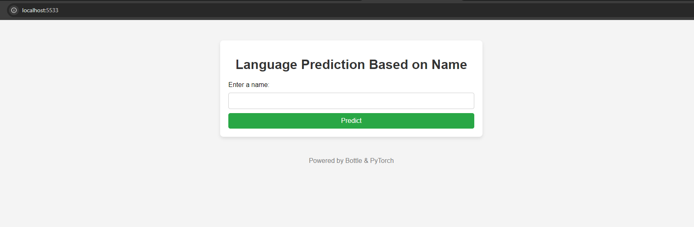
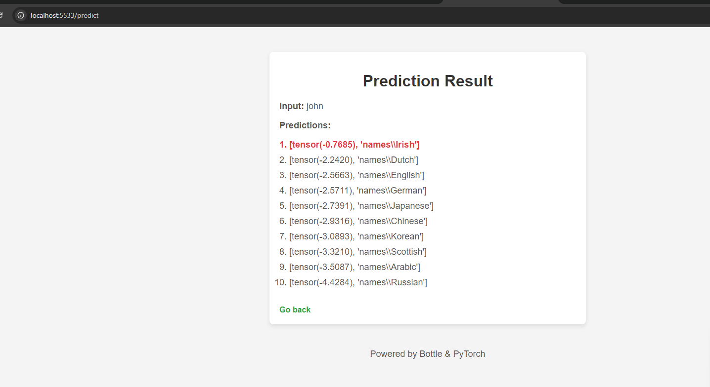

# Name Prediction Web Application

This project is a **Language Prediction Based on Name** web application built using the **Bottle** web framework and **PyTorch**. It allows users to input a name and receive a list of predictions with the top result highlighted as the "winner."

## Features

- **User-Friendly Interface**: A simple form to input a name and generate predictions.
- **Highlighted Winner**: The top prediction is highlighted in red as the winner.
- **List of Predictions**: Displays a ranked list of possible predictions.
- **Real-time Results**: The results are displayed immediately after form submission.
- **Powered by Bottle and PyTorch**: The web interface is built with Bottle, and the prediction engine uses PyTorch.

## Example Webpages

### 1. Input Form



- **Description**: This is the main page where users can input a name and click the "Predict" button to generate predictions.

### 2. Prediction Result



- **Description**: This page shows the prediction results. The top result (winner) is highlighted in **red**, followed by other possible predictions.

## File Structure

```
.
├── app.py                    # Main application file (Bottle web server)
├── char-rnn-classification.pt # Pre-trained model file (PyTorch)
├── data.py                   # Data loading and preprocessing functions
├── model.py                  # Model definition for the name classifier
├── predict.py                # Predict function to generate name predictions
├── train.py                  # Script to train the model
├── docs/                     # Folder containing example screenshots
│   ├── input_form_example.png
│   └── result_page_example.png
└── README.md                 # Project README file
```

### Explanation:

- **`app.py`**: The main server file that handles routes and serves the web pages.
- **`char-rnn-classification.pt`**: The pre-trained model used to generate name predictions.
- **`data.py`**: Data handling and preprocessing logic (e.g., reading the dataset).
- **`model.py`**: Defines the Recurrent Neural Network (RNN) model architecture.
- **`predict.py`**: Contains the logic for making predictions using the trained model.
- **`train.py`**: Script to train the model on a dataset of names and their respective categories.
- **`docs/`**: Folder containing example screenshots for documentation purposes.

## Getting Started

To run the project locally, follow the steps below:

### Prerequisites

- **Python 3.x**
- Required Python packages:
  - `bottle`
  - `torch`

You can install the necessary dependencies using `pip`:

```bash
pip install bottle torch
```

### Running the Application

1. **Clone the Repository**:

   ```bash
   git clone https://github.com/yourusername/name-prediction-app.git
   cd name-prediction-app
   ```

2. **Run the Web Server**:

   Start the server by running:

   ```bash
   python app.py
   ```

3. **Access the Web Application**:

   Open your browser and go to:

   ```
   http://localhost:5533
   ```

## Usage

1. **Input a Name**: On the main page, enter a name in the input field and click "Predict."
2. **View Predictions**: The application will display a ranked list of predictions based on the input name, with the top result highlighted in **red**.

## Prediction Output

The prediction results display a ranked list of possible categories for the input name, using the following format:

1. **Top Prediction (Winner)**: Highlighted in red.
2. **Other Predictions**: Shown below in standard font.

For example, inputting "john" might produce:

```
1. [tensor(-0.7685), 'names\Irish']   # Winner (highlighted in red)
2. [tensor(-2.2420), 'names\Dutch']
3. [tensor(-2.5663), 'names\English']
...
```

## License

This project is licensed under the MIT License - see the [LICENSE](LICENSE) file for details.
